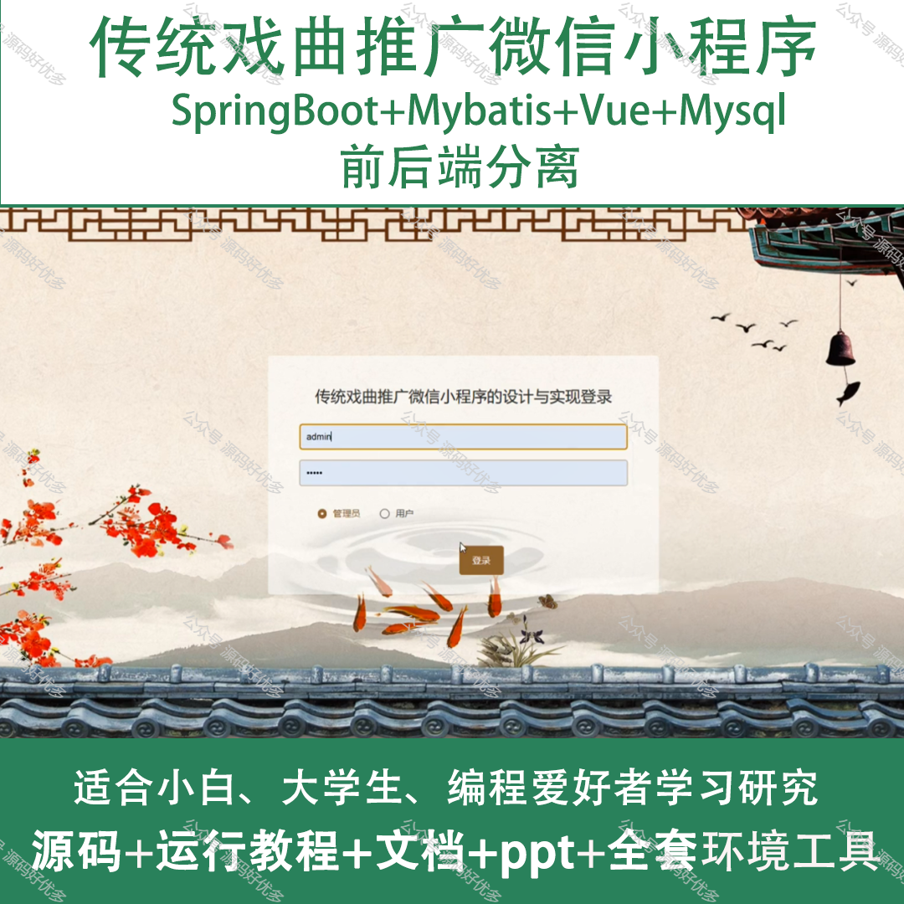
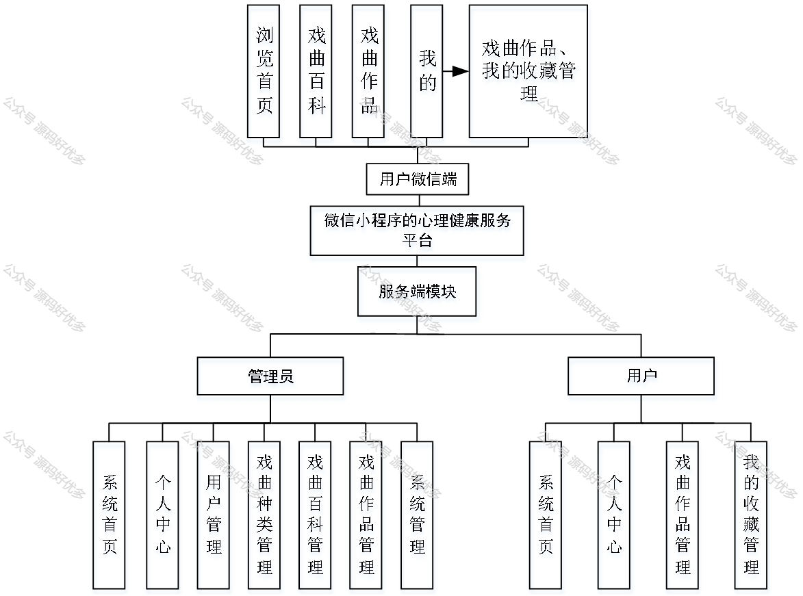
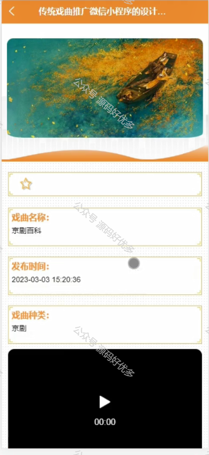
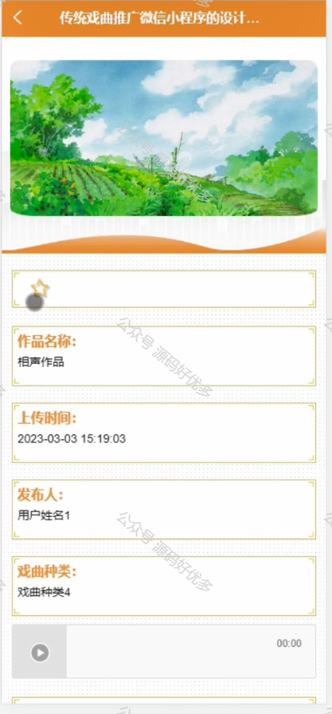
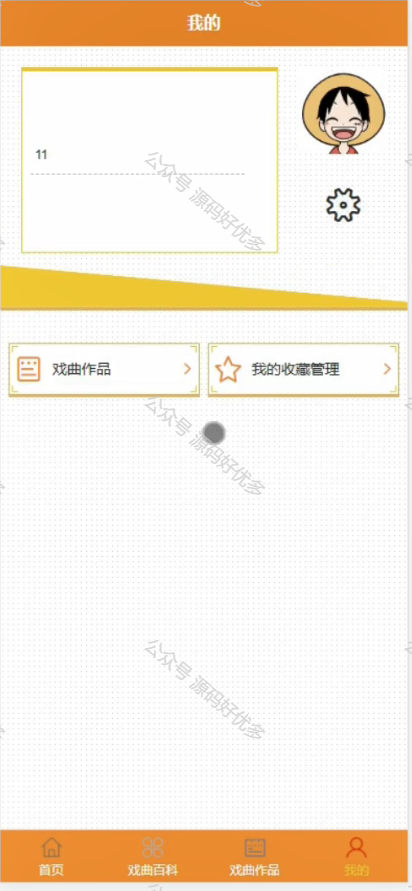
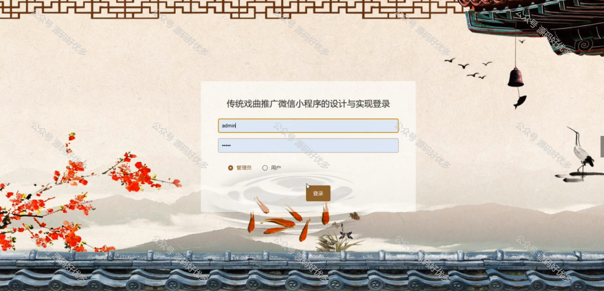
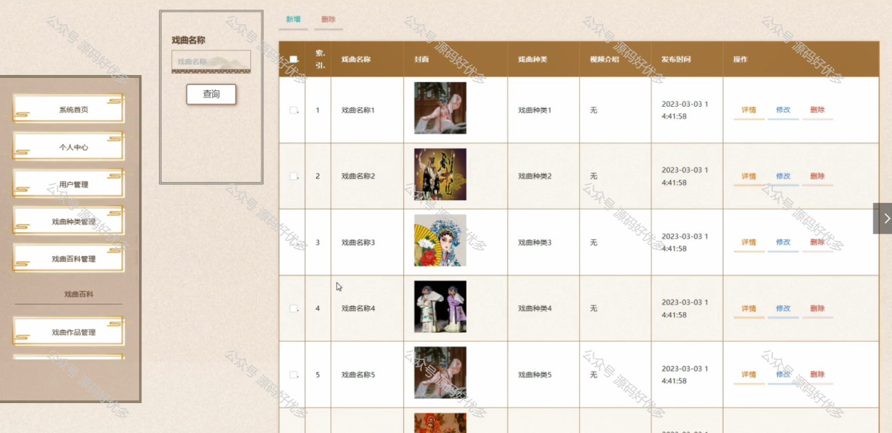
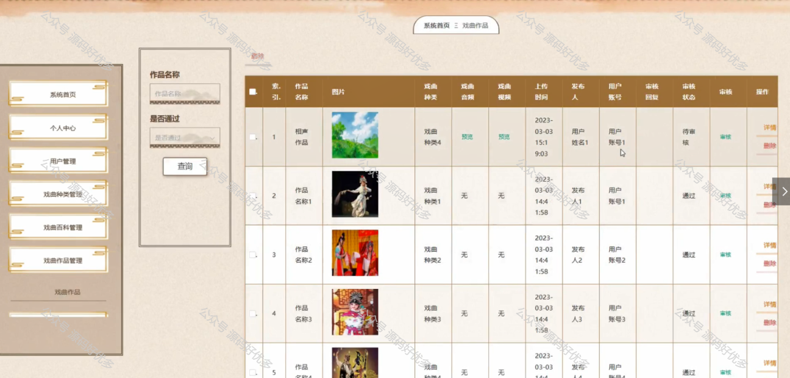
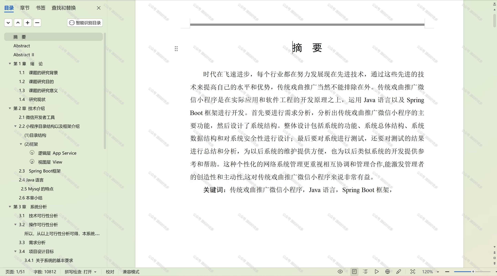

 
## 查看主页获取源码

> **作者介绍**： **✌**全网粉丝10W+本平台特邀作者、博客专家、CSDN新星计划导师、java领域优质创作者,博客之星、掘金/华为云/阿里云/InfoQ等平台优质作者、专注于项目实战 **✌**

  

### 一、作品包含

源码+数据库+设计文档万字+PPT+全套环境和工具资源+部署教程

### 二、项目技术

前端技术：Html、Css、Js、Vue、Element-ui

数据库：MySQL

后端技术：Java、Spring Boot、MyBatis

  

### 三、运行环境

开发工具：IDEA/eclipse + 微信开发者工具

数据库：MySQL5.7

数据库管理工具：Navicat10以上版本

环境配置软件： JDK1.8+Maven3.6.3

前端Nodejs：14

### 四、项目介绍
项目编号：mpweixinA021

"传统戏曲推广"微信小程序，致力于弘扬和传承中华优秀传统文化，旨在为戏曲爱好者提供一个便捷、丰富的戏曲体验平台。通过这款小程序，我们希望能够让更多人了解和喜爱传统戏曲，传承和发展中国戏曲文化。

前台用户功能：浏览首页、戏曲百科、戏曲作品、戏曲作品、我的收藏管理。

后台分为管理员和用户
管理员的功能：系统首页、个人中心、用户管理、戏曲种类管理、戏曲百科管理、戏曲作品管理和系统管理。
用户的功能：系统首页、个人中心、我的收藏管理、戏曲作品管理。

### 五、运行截图

  
